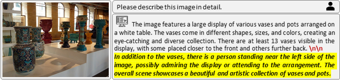

# MiHIO
[](https://opensource.org/licenses/MIT)
[]()
[](https://github.com/hanmenghan/MiHIO/stargazers)
This repository contains the code of our paper.

<p align="center"></p>

Recent advancements in large vision-language models (LVLMs) have demonstrated their impressive capability in visual information understanding with human language. Despite these advances, LVLMs still face challenges with multimodal hallucination, such as generating objects in the descriptions that are not present in the visual information. However, the underlying fundamental reasons of multimodal hallucinations remain poorly explored. In this paper, we propose a new perspective, suggesting that the inherent biases in LVLMs might be a key factor in hallucinations. Specifically, we systematically identify a semantic shift bias related to paragraph breaks ('\n\n'), where the content before and after '\n\n' in the training data frequently behaves significant semantic changes. This pattern leads the model to infer that the contents following '\n\n' should be obviously different from the preceding contents with less hallucinatory descriptions, thereby increasing the probability of hallucinatory descriptions subsequent to the '\n\n'. We have validated this hypothesis on multiple publicly available LVLMs. Besides, we find deliberately inserting '\n\n' at the generated description can induce more hallucinations. A simple method  is proposed to effectively mitigate the hallucination of LVLMs by avoiding the output of `\textbackslash n'.

## Dependence

* Transformer
* Pytorch

The following evaluation requires for MSCOCO 2014 dataset. Please download [here](https://cocodataset.org/#home) and extract it in your data path.

## Core Code

```Python
class MiHOProcessor(LogitsProcessor):
    def __init__(self, tokenizer, LineBreaks='\n\n\n\n', Lam=float("inf"), Mode='None'):
        self.tokenizer = tokenizer
        self.LineBreaksToken  = tokenizer(LineBreaks).input_ids[-1]
        self.Lam = Lam
        self.Mode = Mode
    def __call__(self, input_ids: torch.FloatTensor, scores: torch.FloatTensor):
        if self.Mode == 'MiHO' or self.Mode == 'MiHIO':
            scores[:, self.LineBreaksToken] = scores[:, self.LineBreaksToken]-self.Lam    
        return scores
```

## Questions?

Please report any bugs and I will get to them ASAP. For any additional questions, feel free to email zongbo AT tju DOT edu DOT cn.


